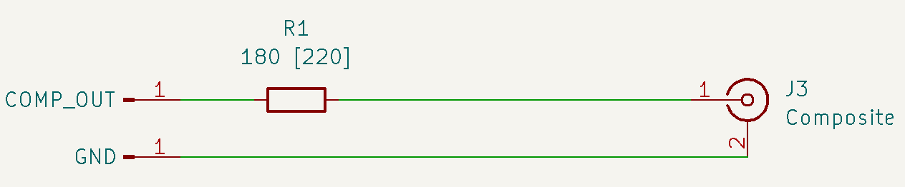

# [IBM PC/XT](https://en.wikipedia.org/wiki/IBM_Personal_Computer_XT) for [MiST](https://github.com/mist-devel) and [DeMiSTify](https://github.com/robinsonb5/DeMiSTify)

MiST and DeMiSTified ports by [@somhi](https://github.com/somhi) from original PCXT port for [MiSTer FPGA](https://mister-devel.github.io/MkDocs_MiSTer/) by [@spark2k06](https://github.com/spark2k06/) (https://github.com/MiSTer-devel/PCXT_MiSTer).

Follow discussion and evolution of the core at [MiSTerFPGA forum](https://misterfpga.org/viewforum.php?f=40) and [MiST Atari-forum](https://atari-forum.com/viewtopic.php?t=42465).

This is a general Readme for all targets. Check also Readme in each board folder. 

**Status of the ports** 

* Now with IDE support HD images can be loaded from SD card.
* Read specific BOARD limitations on each board folder's Readme.
* Read [Bugs / TODO / changes list with respect to the MiSTer port](TODO.md)

## **FPGA platforms**

**MiST ports** 

* Altera Cyclone III:  MiST, MiSTica
* Altera Cyclone IV: SiDi (ManuFerHi EP4CE22)

* Altera Max 10: Arrow Terasic DECA + [MiSTdon](https://github.com/somhi/MiSTdon)

**DeMiSTify ports**

* Altera Max 10: Terasic DE10-lite, Arrow Terasic DECA

* Altera Cyclone IV: NeptUNO (Qmtech EP4CE55), UAreloaded (Qmtech EP4CE55)

* Altera Cyclone V: Arrow Terasic SoCkit

* Altera Cyclone 10 LP: Trenz CYC1000 with Atlas carrier board

  

## Description

The purpose of this core is to implement a PCXT as reliable as possible. For this purpose, the [MCL86 core](https://github.com/MicroCoreLabs/Projects/tree/master/MCL86) from [@MicroCoreLabs](https://github.com/MicroCoreLabs/) and [KFPC-XT](https://github.com/kitune-san/KFPC-XT) from [@kitune-san](https://github.com/kitune-san) are used.

The [Graphics Gremlin project](https://github.com/schlae/graphics-gremlin) from TubeTimeUS ([@schlae](https://github.com/schlae)) for CGA and MDA video output.

[JTOPL](https://github.com/jotego/jtopl) by Jose Tejada (@jotego) was integrated for AdLib sound.

[JT89](https://github.com/jotego/jt89) by Jose Tejada (@jotego) was integrated for Tandy sound.

[MiST](https://github.com/mist-devel) modules is used for MiST and DeMiSTified ports. Specials thanks to [@Gyurco](https://github.com/Gyurco) for helping adding IDE support in MiST ports.

[Demistify](https://github.com/robinsonb5/DeMiSTify) by Alastair M.Robinson ([@robinsonb5](https://github.com/robinsonb5)) is used as a MiST compatible framework using a softcore for aiding porting the core to multiple FPGA boards. More information about deMiSTifying a core can be found on this [tutorial](https://github.com/DECAfpga/DECA_board/tree/main/Tutorials/DeMiSTify). 

## Key features

* 8088 CPU with these speed settings: 4.77 MHz, 7.16 MHz, 9.54 MHz cycle accurate, and PC/AT 286 at 3.5MHz equivalent (max. speed)

* BIOS selectable (Tandy 1000 / PCXT). Compatible BIOS selection (IBM5160, Yuko ST, pcxt31, Tandy, micro8088, XT-IDE, ...)

* XT-IDE support

* Support for IBM Tandy 1000

* Support for IBM PCXT 5160 and clones

* Main memory 640Kb + 384Kb UMB memory

* EMS memory up to 2Mb

* Video modes (VGA or RGB 15 kHz)
  * Tandy graphics with 128Kb of shared VRAM  (not available on all ports due to BRAM resources)
  * CGA graphics 32kB VRAM
  * MDA monochrome
  * Composite (real) video output 
  
* Audio: Adlib, Tandy, Game Blaster, Speaker

* Joystick support

* Mouse support into COM2 serial port, this works like any Microsoft mouse. You just need a driver to configure it, like CTMOUSE 1.9 (available into hdd folder), with the command CTMOUSE /s2 

  

## Quick Start

* Download and uncompress [hd_image.zip](https://github.com/MiSTer-devel/PCXT_MiSTer/raw/main/games/PCXT/hd_image.zip)  on your host system (it contains a [freedos](http://www.freedos.org/ ) image)
* Prepare an SD card for your FPGA 
  * MiST ports: rename previous image to PCXT.HD0 (primary IDE). Secondary IDE disk will be loaded if PCXT.HD1 file is present.
  * DeMiSTify ports: rename previous image to PCXT1.VHD (primary IDE). Secondary IDE disk will be loaded if PCXT2.VHD file is present.
  * Create also a PCXT folder containing all the BIOSes  (see ROM instructions below). 

* Load (or flash) PCXT core with the SD card inserted and press F12 on your keyboard to access the OSD to select options:
  * Model:  IBM PCXT (Note: for Tandy is needed to generate the Tandy BIOS first)
  * CPU Speed: 4.77MHz for better compatibility (PC/AT 3.5MHz for max. speed)
  * BIOS > PCXT BIOS > browse to the BIOS folder and choose e.g. pcxt_pcxt31.rom. For automatic load of BIOSes read section below.
  * Mount IDE: only for DeMiSTify ports select in OSD the VHD or IMG image for primary / secondary IDE HD and Reset core.
* To load floppies it is only possible with an USB serial cable connected to your Host computer using [Serdrive](SW/ ) as explained below at Mounting the disk image section. With this method it is possible to load HD images also. Press ALT key during boot to detect the COM drives.


## BIOS instructions

BIOSes can be selected in the BIOS section of the OSD menu. After selecting each BIOS a reset is done. 

Automatically load of BIOS is possible by leaving the BIOS files into the root of the SD card with the following names:

* MiST ports: PCXT.ROM and PCXT.R01 for the PCXT BIOS (2 files duplicated), PCXT.R02 for the TANDY BIOS, PCXT.R03 for the XT-IDE BIOS (needed to load the OS). Note: micro8088 BIOS does nos work well with MiST ports

* DeMiSTify ports: PCXT.ROM  for the PCXT BIOS, TANDY.ROM for the TANDY 1000 BIOS, XTIDE.ROM for the XT-IDE BIOS (needed to load the OS)

ROMs provided in SW/ROMs folder:

* SW/ROMs  are used for ports with HD IDE implementation (Serdrive is also possible to be used if you press the ALT key during boot to load other images or floppies)
* SW/ROMs/XT-IDE_COM are used for ports using serdrive to load images from serial cable (no need to press ALT key)
* SW/ROMs/BASICA  updated with the "Full Operation Mode" option enabled, it is now compatible with the BASICA application and some other Tandy 1000 software that might be incompatible with this mode disabled. 

Scripts incorporated to generate other BIOSes:

* `make_rom_with_ibm5160.py`: A valid ROM is created for the PCXT model (pcxt.rom) based on the original IBM 5160 ROM, requires the XTIDE BIOS at address EC00h to work with HD images.
* `make_rom_with_jukost.py`: A valid ROM is created for the PCXT model (pcxt.rom) based on the original Juko ST ROM, and with the XTIDE BIOS embedded at address F000h.
* `make_rom_with_tandy.py`: A valid ROM is created for the Tandy model (tandy.rom) based on the original Tandy 1000 ROM, requires the XTIDE BIOS at address EC00h to work with HD images.

From the same BIOS section of the OSD it is possible to specify an XTIDE ROM of up to 16Kb to work at address EC00h. It is also provided in this folder (ide_xtl.rom).

Other Open Source ROMs are available in the same folders:

* `pcxt_pcxt31.rom`: This ROM already has the XTIDE BIOS embedded at address F000h. ([Source Code](https://github.com/virtualxt/pcxtbios))
* `pcxt_micro8088.rom`: This ROM already has the XTIDE BIOS embedded at address F000h. ([Source Code](https://github.com/skiselev/8088_bios))
* `ide_xtl.rom`: This ROM corresponds to the XTIDE BIOS, it must be maintained for some scripts to work, it can also be upgraded to a newer version. ([Source Code](https://www.xtideuniversalbios.org/))

NOTES:

* ROMs working with MDA video: (IBM5160, Yuko ST and pcxt31 work), (Tandy, micro8088, full XTIDE BIOS do not work). If you load a BIOS that does not work with MDA you may need to power cycle the board.

* IBM5160 BIOS: Starting BIOS at PC/AT 3.5MHz (max. speed), lights start blinking and keyboard doesn't work anymore. Starting BIOS at 4.77 MHz and changing it thereafter during the RAM test to PC/AT 3.5MHz (max. speed) it lets you work in this BIOS without keyboard problems.

  

**Other BIOSes**

* https://github.com/640-KB/GLaBIOS

  

## Mounting the disk image with Serdrive

With IDE drive support to load HD images now serdrive is mostly useful to load floppy images.

Floppy and HD images can be loaded trough serial UART with the XT IDE BIOS while pressing the ALT key during BIOS boot. This could be done with a USB-Serial cable connected from a PC to the FPGA. [Serdrive](SW/ ) program is required in the host computer serving the OS/floppy image/s.

```sh
#Usage: SerDrive [options] imagefile [[slave-options] slave-imagefile]
#You should know the geometry of the disk (-g parameter) and the serial port of the host computer (-c parameter). UART speed is set by the -b parameter

#Linux example
serdrive_x64 -v -c /dev/ttyUSB0 -b 460.8Kb floppy.img
serdrive_x64 -g 733:7:17 -v -c /dev/ttyUSB0 -b 460.8Kb PCXT_CGA_Tandy.img 
serdrive_x64 -g 733:7:17 -v -c /dev/ttyUSB0 -b 460.8Kb PCXT_CGA_Tandy.img floppy.img
#Windows example
serdrive.exe -v [-c <port>] -d 460.8Kb <image_floppy>
serdrive.exe -g 733:7:17 -v [-c <port>] -d 460.8Kb <image_OS> <image_floppy>
```

The floppy disk image is recognised by XTIDE as B: in all BIOSes except JukoST, so to boot from the floppy disk, press the 'A' or B' key when the XTIDE boot screen appears. 

**Some notes about serdrive**

* 115.2 kbps does not work

* 921.6 kbps only works at max speed

* Core has enabled RTS/CTS control signals which gives better stability and speed to the HDD

  * Windows does not care about RTS/CTS signals

  * In Linux those RTS/CTS lines need to be connected for XTIDE to detect the image. Take care that CTS goes to RTS and RTS to CTS.

    


## OSD Controls

* F12 show / hide OSD 
* DeMiSTified ports: Long F12 toggles VGA/RGB mode 


## MACROS defined in defs.v

Not all boards have the resources (BRAM, logic cells) to implement  all the sound cards and video modes with maximum memory, so there is a defs.v file in each board folder that defines which modules are implemented.

You can edit this file prior to compile the core to test different configurations of the core. If there is not enough resources Quartus will tell you.


## **Composite real CGA video output** 

CGA mode has available composite video output through:

* Green pin of the DB15 VGA connector
  * Just add 1 resistor of 180 Ohm (could be 220) between the FPGA composite output pin and the TV composite input central pin. 

* Simultaneous output through 1 GPIO pin 
  * Same circuit as DB15 green pin. Check pin location in the corresponding top and qsf files inside the respective board folder
  * Optionally a second pin might be used with a 2k resistor connected as schematic below  
  * Currently only implemented in Atlas CYC1000, Deca and Neptuno boards.





## To-do list

Features from MiSTer port not ported yet:

* Floppy implementation

* Simulated composite implementation 

* Border (overscan)

* Hercules graphic mode

  


## Compile the project in Quartus:

Project already has the Demistify firmware already generated so if you clone it recursively then you can open the project with Quartus:

```sh
git clone  --recursive https://github.com/somhi/PCXT_DeMiSTify

#check comments on top of /[board target]/[board target]_top.vhd in case additional actions are needed

#Load project in Quartus from /FPGAtarget/PCXT_[board target].qpf

# where [board target] is deca, neptuno, uareloaded, atlas_cyc, sidi, ...
```


## DeMiSTify ports instructions to full compile the project for a specific board:

```sh
git clone https://github.com/somhi/PCXT_DeMiSTify
cd PCXT_DeMiSTify
#Do a first make (will finish in error) but it will download missing submodules 
make
cd DeMiSTify
#Create file site.mk in DeMiSTify folder 
cp site.template site.mk
#Edit site.mk and add your own PATHs to Quartus (Q18)
gedit site.mk
#Go back to root folder and do a make with [board target] (deca, de10lite, neptuno, uareloaded, sidi, sockit, atlas_cyc). If not specified it will compile for all targets.
cd ..
make BOARD=[board target]
#when asked just accept default settings with Enter key
```


## Developers

Any contribution and pull request, please carry it out on the devel branch. Periodically they will be reviewed, moved and merged into the main branch, together with the corresponding release.

Thank you!
