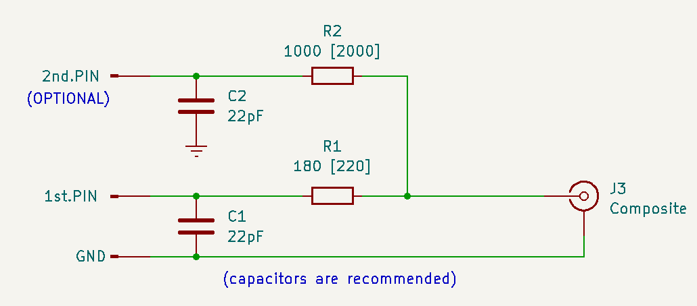

# [IBM PC/XT](https://en.wikipedia.org/wiki/IBM_Personal_Computer_XT)  [DeMiSTified](https://github.com/robinsonb5/DeMiSTify)

DeMiSTified ports by [@somhi](https://github.com/somhi) from original PCXT port for [MiSTer FPGA](https://mister-devel.github.io/MkDocs_MiSTer/) by [@spark2k06](https://github.com/spark2k06/) (https://github.com/MiSTer-devel/PCXT_MiSTer).

Follow discussion and evolution of the core at [MiSTerFPGA forum](https://misterfpga.org/viewforum.php?f=40).

This is a general Readme. Check specific Readme in each board folder. See list of ported platforms below.

**Status of the ports** 

* Read To-do list below
* Read specific BOARD limitations on each board folder's readme
* Read [Bugs / TODO / changes list with respect to the MiSTer port](TODO.md)

## Description

The purpose of this core is to implement a PCXT as reliable as possible. For this purpose, the [MCL86 core](https://github.com/MicroCoreLabs/Projects/tree/master/MCL86) from [@MicroCoreLabs](https://github.com/MicroCoreLabs/) and [KFPC-XT](https://github.com/kitune-san/KFPC-XT) from [@kitune-san](https://github.com/kitune-san) are used.

The [Graphics Gremlin project](https://github.com/schlae/graphics-gremlin) from TubeTimeUS ([@schlae](https://github.com/schlae)) has also been integrated in this first stage.

[JTOPL](https://github.com/jotego/jtopl) by Jose Tejada (@jotego) was integrated for AdLib sound.

[JT89](https://github.com/jotego/jt89) by Jose Tejada (@jotego) was integrated for Tandy sound.

[Demistify](https://github.com/robinsonb5/DeMiSTify) by Alastair M.Robinson ([@robinsonb5](https://github.com/robinsonb5)) is used as a MiST compatible framework using a softcore for aiding porting the core to multiple FPGA boards. More information about deMiSTifying a core can be found on this [tutorial](https://github.com/DECAfpga/DECA_board/tree/main/Tutorials/DeMiSTify). 

## Key features

* 8088 CPU with these speed settings: 4.77 MHz, 7.16 MHz, 9.54 MHz cycle accurate, and PC/AT 286 at 3.5MHz equivalent (max. speed)
* BIOS selectable (Tandy 1000 / PCXT). Compatible BIOS selection (IBM5160, Yuko ST, pcxt31, Tandy, micro8088, XT-IDE, ...)
* XTIDE support
* Support for IBM Tandy 1000
* Support for IBM PCXT 5160 and clones
* Main memory 640Kb + 384Kb UMB memory
* EMS memory up to 2Mb
* Video modes: 
  * Tandy graphics with 128Kb of shared VRAM  (not available on all ports due to BRAM resources)
  * CGA graphics 32kB VRAM (VGA or Composite)
  * MDA monochrome
  * Composite real video output 
* Audio: Adlib, Tandy, speaker
* Joystick support
* Mouse support into COM2 serial port, this works like any Microsoft mouse... you just need a driver to configure it, like CTMOUSE 1.9 (available into hdd folder), with the command CTMOUSE /s2 

## Quick Start

* Download and uncompress [hd_image.zip](https://github.com/MiSTer-devel/PCXT_MiSTer/raw/main/games/PCXT/hd_image.zip)  on your host system. It contains a [freedos](http://www.freedos.org/ ) image
* Load the OS image with [Serdrive](SW/ ) as explained below at Mounting the disk image
* Prepare an SD card for your FPGA with a PCXT folder containing the BIOS  (see ROM instructions below)
* Upload bitstream into your FPGA (check release in each FPGA folder)
* Press F12 on your keyboard to access the OSD and select options below
  * Model: IBM PCXT
  * CPU Speed: choose PC/AT 3.5MHz (max. speed)
  * BIOS > PCXT BIOS > browse to the SD folder and choose  pcxt_micro8088.rom or any other ROM

If you leave the BIOS files into the root of the SD card with the following names, they will be loaded automatically after the splash screen:

* PCXT.ROM  for the IBM PCXT model
* TANDY.ROM for the TANDY 1000 model
* XTIDE.ROM for the EC00 BIOS needed to load the OS for Tandy and some PCXT BIOS


## ROM Instructions

ROMs should be provided initially from the BIOS section of the OSD menu, then it is only necessary to indicate the computer model and reset, on subsequent boot of the core, it is no longer necessary to provide them, unless we want to use others. Original and copyrighted ROMs can be generated on the fly using the python scripts available in the SW folder of this repository:

* `make_rom_with_ibm5160.py`: A valid ROM is created for the PCXT model (pcxt.rom) based on the original IBM 5160 ROM, requires the XTIDE BIOS at address EC00h to work with HD images.
* `make_rom_with_jukost.py`: A valid ROM is created for the PCXT model (pcxt.rom) based on the original Juko ST ROM, and with the XTIDE BIOS embedded at address F000h.
* `make_rom_with_tandy.py`: A valid ROM is created for the Tandy model (tandy.rom) based on the original Tandy 1000 ROM, requires the XTIDE BIOS at address EC00h to work with HD images.

From the same BIOS section of the OSD it is possible to specify an XTIDE ROM of up to 16Kb to work at address EC00h. It is also provided in this repository.

Other Open Source ROMs are available in the same folder:

* `pcxt_pcxt31.rom`: This ROM already has the XTIDE BIOS embedded at address F000h. ([Source Code](https://github.com/virtualxt/pcxtbios))
* `pcxt_micro8088.rom`: This ROM already has the XTIDE BIOS embedded at address F000h. ([Source Code](https://github.com/skiselev/8088_bios))
* `ide_xtl.rom`: This ROM corresponds to the XTIDE BIOS, it must be maintained for some scripts to work, it can also be upgraded to a newer version. ([Source Code](https://www.xtideuniversalbios.org/))

NOTES:

* ROMs working with MDA video: (IBM5160, Yuko ST and pcxt31 work), (Tandy, micro8088, full XTIDE BIOS do not work).

* IBM5160 BIOS: Starting BIOS at PC/AT 3.5MHz (max. speed), lights start blinking and keyboard doesn't work anymore. Starting BIOS at 4.77 MHz and changing it thereafter during the RAM test to PC/AT 3.5MHz (max. speed) it lets work in this BIOS without keyboard problems.

## Other BIOSes

* https://github.com/640-KB/GLaBIOS

## Mounting the disk image (serdrive)

Currently floppy and hdd images can only be loaded trough serial UART with the XT IDE BIOS. This could be done with a USB-Serial cable connected from a PC to the FPGA. [Serdrive](SW/ ) program is required in the host computer serving the OS/floppy image/s.

```sh
#Usage: SerDrive [options] imagefile [[slave-options] slave-imagefile]
#You should know the geometry of the disk (-g parameter) and the serial port of the host computer (-c parameter). UART speed is set by the -b parameter

#Linux example
serdrive_x64 -g 733:7:17 -v -c /dev/ttyUSB0 -b 921.6K PCXT_CGA_Tandy.img 
serdrive_x64 -g 733:7:17 -v -c /dev/ttyUSB0 -b 921.6K PCXT_CGA_Tandy.img floppy.img
#Windows example
serdrive.exe -g 733:7:17 -v [-c <port>] -d 460.8Kb <image_OS> <image_floppy>
```


The floppy disk image is recognised by XTIDE as B: in all BIOSes except JukoST, so to boot from the floppy disk, press the 'B' key when the XTIDE boot screen appears. Mounting and unmounting of such a drive becomes effective after a BIOS reset. Floppy swapping is possible as long as the drive was previously mounted.

**Some notes about serdrive**

* 115.2 kbps does not work

* 921.6 kbps only works at max speed

* Core has enabled RTS/CTS signals which gives better stability and speed to the HDD

  * Windows does not care about RTS/CTS signals

  * In Linux those RTS/CTS lines need to be connected for XTIDE to detect the image. Take care that CTS goes to RTS and RTS to CTS.

    

## **Composite real CGA video output** 

CGA mode has available composite video output through:

* Green pin of the DB15 VGA connector
* Simultaneous output through 1 GPIO pin 
  * Check pin location in the corresponding top and qsf files inside the respective board folder
  * Optionally a second pin might be used with a 2k resistor connected in the same way as the first pin  
  * Currently only implemented in Atlas cyc1000, Deca and Neptuno boards.


Just add 1 resistor in series of 180 Ohm (could be 220) between the FPGA composite output pin and the TV composite input central pin. 




## **Ported FPGA platforms**

* Altera Max 10:

  * Terasic DE10-lite
  * Arrow Terasic DECA

* Altera Cyclone III:  MiST, MiSTica

* Altera Cyclone IV:

  * NeptUNO (Qmtech EP4CE55)
  * UAreloaded (Qmtech EP4CE55)
  * SiDi (ManuFerHi EP4CE22)

* Altera Cyclone V: Arrow Terasic SoCkit

* Altera Cyclone 10 LP: Trenz CYC1000 with Atlas carrier board

  

## To-do list

* 8-bit IDE module implementation

* Floppy implementation

* RTC implementation

* Simulated composite implementation (note that is available real composite instead)

* Border (overscan)

* Saving OSD configuration

  
